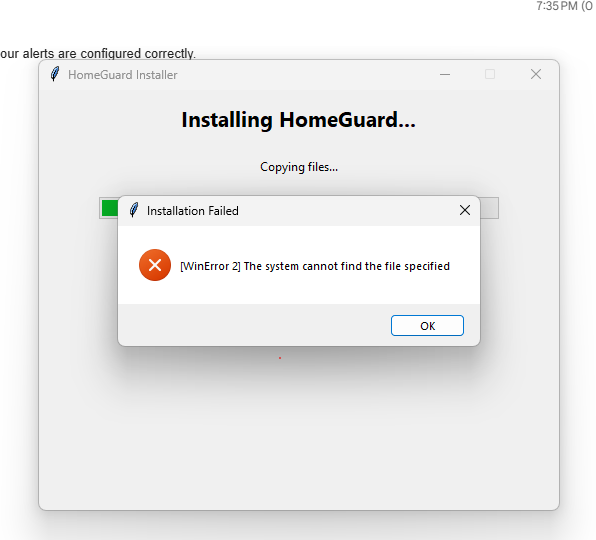

<div align="center">



# 🛡️ HomeGuard

**Free parental control that protects your child's Windows PC.**

*No subscriptions. No hardware. Just your email.*

</div>

---

## 🏢 About DNSafe

**HomeGuard is brought to you by [DNSafe](https://dnsafe.io)** — a company dedicated to building free, accessible internet safety tools for families.

DNSafe believes that every parent deserves a simple way to protect their children online, without expensive subscriptions or complex hardware. That's why we made HomeGuard **open source**: so the community can use it, improve it, and share it for good.

**Owner:** Dhia El Hak Rached

---

## 👋 What is HomeGuard?

Every time your child opens a website, their computer asks a **DNS server**: "What is the address of google.com?"

HomeGuard **steps in the middle** of that question. It becomes your computer's local DNS guardian:

- ✅ **Clean site?** → Forwards to Cloudflare and returns the real answer.
- 🚫 **Bad site?** (adult, gambling) → Instantly blocks it and **emails you within seconds**.

Because this happens at the **operating system level**, it works in **every browser**, in **Incognito mode**, and even inside **apps**. Your child cannot simply disable a browser extension to bypass it.

---

## 📦 What You Get

HomeGuard comes as three simple files. Think of them like a car:

| File | What it is | Analogy |
|---|---|---|
| 🧰 **`installer.exe`** | The setup wizard you run **once** | The dealership that delivers the car |
| 🔒 **`HomeGuardService.exe`** | The invisible DNS protection engine | The engine running under the hood |
| 🖥️ **`HomeGuard.exe`** | A tiny green shield in your system tray | The dashboard showing speed and fuel |

> **Important:** The tray icon is just a monitor. If your child closes it, the DNS engine **keeps running**.

---

## ⚙️ What You Need Before Starting

You only need one thing: an **app password** from your email provider.

> **What is an app password?**  
> It is a special 16-character password that apps use to send email on your behalf. It is **NOT** your normal email password.

- **[Gmail]** Create an app-password → [support.google.com/accounts/answer/185833](https://support.google.com/accounts/answer/185833)
- **[Outlook]** Create an app-password → [support.microsoft.com/account-billing/using-app-passwords](https://support.microsoft.com/en-us/account-billing/using-app-passwords-with-apps-that-don-t-support-two-step-verification-5896ed9b-4263-e681-128a-a6f6729ece78)
- **[Yahoo]** Create an app-password → [help.yahoo.com/kb/SLN15241.html](https://help.yahoo.com/kb/SLN15241.html)

---

## 🚀 Step-by-Step Setup

### Step 1 — Download & Extract

1. Download `HomeGuard.zip`.
2. Right-click it → **Extract All**.
3. Open the folder.

You should see three `.exe` files inside.

---

### Step 2 — Run the Installer as Administrator

1. Right-click **`installer.exe`**.
2. Choose **Run as administrator**.
3. Windows will ask: *"Do you want to allow this app to make changes?"* Click **Yes**.

---

### Step 3 — Follow the Wizard

The installer will guide you through four simple screens:

| Screen | What to do |
|---|---|
| **Welcome** | Click **Next**. |
| **Parent Settings** | Choose your email provider, enter your email, paste your **app password**, and type your child's name. |
| **Test Email** | Click **Send Test Email**. Check your inbox for a message from HomeGuard. |
| **Install** | Click **Install**. Wait about 10 seconds. |

That's it! A green shield 🛡️ will appear in your system tray (bottom-right corner near the clock).

---

### Step 4 — Verify It's Working

1. Open any browser.
2. Try visiting a blocked site (e.g., an adult domain).
3. The browser should show: *"This site can't be reached"* or *"Hmm, we're having trouble finding that site."*
4. Check your email. You should see a `🚨 HomeGuard Alert` within seconds.

---

## 📧 What You See in Your Inbox

> **Subject:** 🚨 HomeGuard Alert — Blocked Access Attempt
>
> Child: Alex  
> Attempted site: bad-example.com  
> Time: 2026-05-30 18:45  
> Category: Pornography  
> Action: Blocked (site does not exist)

**Rate limiting:** The same blocked domain will only trigger one email every 15 minutes. However, **every attempt is still logged** to the local database, so you can see the full history anytime.

---

## 🖱️ Using the System Tray Icon

Right-click the green shield 🛡️ to see your options:

| Option | What it does |
|---|---|
| **Status: Running** | Shows whether blocking is active. |
| **Pause** | Temporarily allows all websites. The icon turns **orange** 🟠. |
| **Resume** | Re-activates blocking. The icon turns **green** 🟢 again. |
| **Open Log Folder** | Opens the folder containing the database and log files. |
| **Edit Config** | Opens `config.ini` in Notepad if you need to change your email or settings. |
| **Exit** | Closes the tray icon only. The DNS protection **continues running** in the background. |

---

## 🗑️ How to Uninstall

### Method 1 — Windows Settings
1. Open **Settings → Apps → Installed apps**.
2. Find **HomeGuard**.
3. Click **Uninstall**.

### Method 2 — Run the Installer
1. Right-click `installer.exe` → **Run as administrator**.
2. Add `--uninstall` to the command:
   ```
   installer.exe --uninstall
   ```

### What the uninstaller does
- Stops the HomeGuard Windows Service.
- Restores your original DNS settings from the backup.
- Removes the startup shortcut.
- Deletes `C:\Program Files\HomeGuard\`.
- Removes the registry entry from "Add or Remove Programs."

---

## ❓ Parent FAQ

### Will this slow down the internet?
No. Local lookups take less than 1 millisecond. Upstream forwarding adds no noticeable delay.

### Can my child disable it?
Not easily. The DNS proxy runs as a Windows Service under the `SYSTEM` account. Disabling it requires Administrator rights. The tray icon is just a monitor — killing it does not stop protection.

### Does it work with Chrome's "Secure DNS"?
Make sure Chrome is set to **"Use your current service provider"** (not Cloudflare or Google directly). HomeGuard will still forward clean queries to those servers.

### What if the PC is offline?
Blocklists are cached locally (`blocklist_cache.json.gz`), so blocking continues to work. Emails queue until the next successful SMTP connection.

### Why does the browser say "site not found" instead of "blocked"?
This is intentional. Returning "site not found" makes the child think the website is down or does not exist. This avoids shame or embarrassment and makes your follow-up conversation feel like guidance rather than punishment.

### What if I change my Wi-Fi network?
HomeGuard sets DNS on the operating system level, not per-network. It works across Ethernet, Wi-Fi, and even mobile hotspots. If you reinstall Windows or switch adapters, simply run the installer again.

### Where are my email credentials stored?
They are stored in `config.ini` inside `C:\Program Files\HomeGuard\`. This file is readable only by Administrators. We recommend using an **app-password** (not your main email password) so the credential is limited in scope.

### Can I block other categories (social media, games, etc.)?
Yes. Open `config.ini`, find the `[blocklist]` section, and add more StevenBlack list URLs. For example:
```ini
urls = https://raw.githubusercontent.com/StevenBlack/hosts/master/alternates/porn-only/hosts,https://raw.githubusercontent.com/StevenBlack/hosts/master/alternates/gambling-only/hosts,https://raw.githubusercontent.com/StevenBlack/hosts/master/alternates/social-only/hosts
```
Then restart the HomeGuard Windows Service.

---

## 🧑‍💻 For Developers

If you are modifying the code, you can run components directly in Python without building `.exe` files.

### Dev-mode launcher (fastest iteration)

Use the included `dev.py` script. It auto-fallbacks to port 53535 if you are not Administrator, so you can test code changes instantly.

```bash
# Proxy + tray, no admin required
python dev.py

# Headless proxy only (debug blocklist/email logic)
python dev.py --no-tray

# Full system test on port 53 (requires admin, restores DNS on exit)
python dev.py --admin

# Disable email rate-limiting while testing SMTP changes
python dev.py --rate-limit 0
```

### Run individual components manually

If you prefer to start pieces by hand instead of using `dev.py`:

```bash
# DNS proxy only (port 53, needs admin)
python -c "from src.guardian import main; main()"

# Tray GUI only (port 53, needs admin)
python src/tray_gui.py

# Installer wizard (needs admin)
python installer/installer.py
```

### Build the executables after modifying code

HomeGuard uses **PyInstaller `.spec` files** that bundle the correct hidden imports and data files. **Always build from the `.spec` files** instead of raw `pyinstaller` CLI commands.

**1. Install PyInstaller**
```bash
pip install pyinstaller
```

**2. Build all three executables**
```bash
pyinstaller HomeGuard.spec
pyinstaller HomeGuardService.spec
pyinstaller installer.spec
```

**3. Collect the output files**
After building, the `.exe` files will be in the `dist/` folder:
```
dist/
  HomeGuard.exe          ← System tray control panel
  HomeGuardService.exe   ← DNS proxy Windows Service
  installer.exe          ← Setup wizard
```

**4. Create the release package**
Copy these three files into a folder (or zip them) for distribution:
```
HomeGuard/
  installer.exe
  HomeGuard.exe
  HomeGuardService.exe
```

> **Note:** The installer will automatically copy `HomeGuard.exe` and `HomeGuardService.exe` to `C:\Program Files\HomeGuard\` during setup. The user only needs to run `installer.exe`.

---

## 🙏 Credits

**Delivered by [DNSafe](https://dnsafe.io)**  
**Owner:** Dhia El Hak Rached  
**License:** MIT — free to use, modify, and share.

DNSafe is committed to keeping families safe online through open-source innovation. If you find HomeGuard useful, please consider sharing it with other parents.

---

## 📄 License

MIT — free to use, modify, and share.
